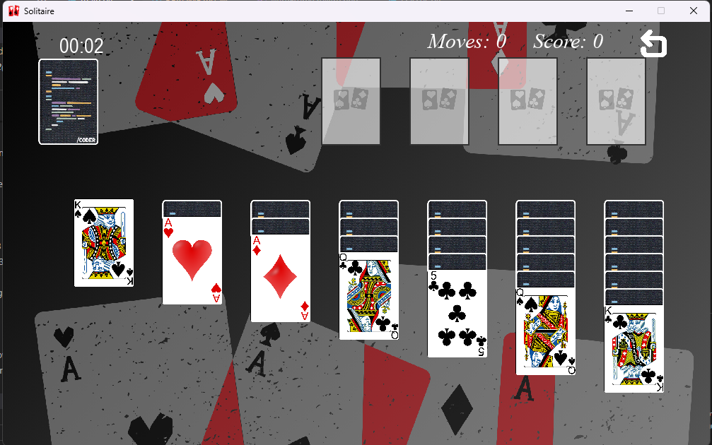

#Course Code
            CSC200

#Instructed By
            **Prof. Nazeef Ul Haq**

# Solitaire Game - Klondike Version

## Description
This is a Klondike Solitaire game project, developed as part of a Data Structures and Algorithms (DSA) course project. It focuses on implementing fundamental DSA concepts like linked lists, stacks, queues, arrays, and hashmaps, alongside object-oriented programming (OOP) principles. The game allows players to experience classic Solitaire gameplay with drag-and-drop functionality.

## Features
- **Drag-and-Drop**: Click and drag cards between tableau piles, foundation piles, and the stockpile.
- **Card Shuffling**: Cards are shuffled randomly at the start of each game to simulate a real deck shuffle.
- **Undo/Redo Moves**: Players can undo and redo moves to correct mistakes.
- **Win Condition**: The game ends when all cards are successfully sorted into the foundation piles according to Solitaire rules.
- **Game Rules**: The game follows Klondike Solitaire rules, including tableau restrictions, foundation sorting, and draw-from-stock mechanics.

## Data Structures Used
- **Linked Lists**: Used in tableau piles for managing cards in each pile.
- **Stacks**: Utilized in the undo/redo functionality to track moves and foundations are made of stack.
- **Queues**: Employed in certain gameplay operations, like managing moves.
- **Arrays/Lists**: For general card management, shuffling, and rendering.
- **Dictionaries**: Used for quick access to card properties and pile information.
## WireFrame

## Installation
To install and run this Solitaire game, follow these steps:

1. **Clone the Repository**:
   ```bash
   git clone https://gitlab.com/group5261841/csc200m24pid87.git
   cd solitaire-game


2. **Install Dependencies**:
Ensure Python 3.x is installed. Run the following to install any additional dependencies if needed:
    ```bash
        pip install -r requirements.txt
3. **Run the Game**:
                     Start the game by running:
    ```bash

        python main.py